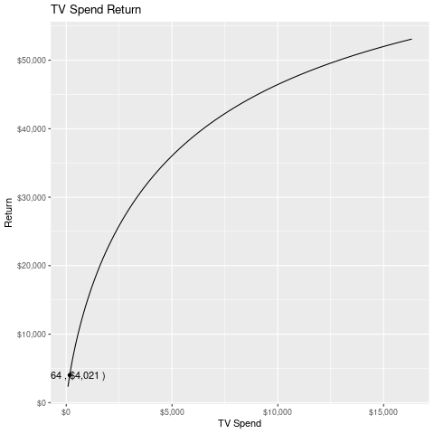
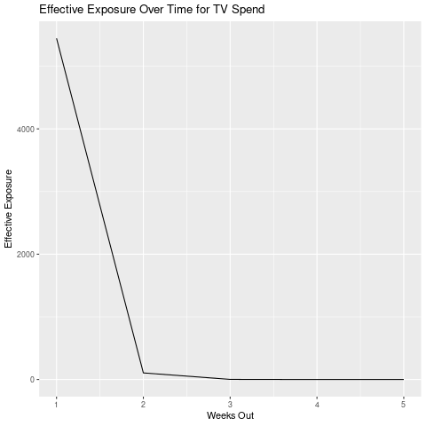

---
output:
	rmarkdown: github_document
		keep_md: true
		self_contained: true
---


```{r, include = FALSE}
knitr::opts_chunk$set(
  collapse = TRUE,
  comment = "#>",
  fig.path = "./man/figures/",
  echo = TRUE,
  dev = 'png'
)
```
  
# rabinoffmmmr

<!-- badges: start -->
<!-- badges: end -->

The goal of rabinoffmmmr is to provide an interface for building and employing media mix models that more closely resembles building and employing standard statistical and machine learning models. Model parameters will be stored in an initial model spec object of class `mmmr`, which then can be used with `fit`, `predict`, and `coef`. Plotting and reporting functions will be added.

## Installation

You can install the development version of rabinoffmmmr like so:

``` r
## NOT RUN
#devtools::install_github("DerksenRabinoff/rabinoffmmmr")
```

## Example

Attaching rabinoffmmmr. Sample training data will be loaded called `historical_ad_spends`. Sample data to predict on will be loaded called `spend_plan`.

```{r setup, eval = FALSE}
library(rabinoffmmmr)
```
 
The mmm needs to know the dependent variable, the date variable, and which channels need diminishing returns and adstocking calculated.

### Model Setup

```{r set up variables}
## The data has the following columns
dependent <- "Sales"
date <- "Week Starting"

## Let's suppose the following are subject to diminishing returns effects
saturation_vars <- c("TV Spend", "Radio Spend", "Online Video Spend", "Social Media Spend")

## Let's suppose the following are subject to adstocking effects (retention in consumer memory)
adstocking_vars <- c("TV Spend", "Radio Spend", "Social Media Spend", "Search Ads Spend", "Direct Mail Spend")

## The predictors will include all variables other than the date and dependent variable
predictor_vars <- setdiff(names(historical_ad_spends), c(dependent, date))

## Make sure the date variable is of type "Date" and that every row has a date
historical_ad_spends[[date]] <- lubridate::as_date(historical_ad_spends[[date]])
historical_ad_spends %<>% dplyr::filter(!is.na(`Week Starting`))
head(historical_ad_spends) %>% knitr::kable()
```
 
Set up an mmmr model
```{r model}
## Use the variables above to make an mmmr model. The remainder of the variables will use default values
model <- mmmr(predictors = predictor_vars, saturated = saturation_vars, adstocked = adstocking_vars, dep_col = dependent, date_col = date)
```
 
### Model Training And Results
 
Train the model
```{r training, cache = TRUE}
start_time <- Sys.time()
model_fit <- fit.mmmr(object = model, data = historical_ad_spends, silent = TRUE, maxiter = 1)
print(Sys.time() - start_time)
``` 

Parameters and coefficients of the model:
```{r results}
## "complete" means include coefs that are 0. "params" means include the alpha, gamma, and theta parameters of the fit.
model_results <- coef(model_fit, complete=TRUE, params = TRUE)
model_results %>% knitr::kable()
```

Predictions from the model. If adstocking is high (high thetas) consider cutting the first few rows. Adstocking values depend on previous rows.
```{r predict}
## Load new data

spend_plan[[date]] <- lubridate::as_date(spend_plan[[date]], format = "%B %d, %Y")
spend_plan %<>% dplyr::filter(!is.na(`Week Starting`))

predictions <- predict.mmmr_fit(model_fit, spend_plan)

print(predictions)
```

You can include the full modified data with the predict method as well. This may be useful if you want to see the return for individual columns. In this table, each column represents the weekly contribution of that predictor to sales.
```r
predictions_tbl <- predict.mmmr_fit(model_fit, full_table = TRUE)
head(predictions_tbl) %>% knitr::kable()
```

### Visualizations

There are two functions, `plot_diminishing_returns` and `plot_adstocking` that can visualize the return on individual ad channels. `plot_diminishing_returns` presents the return of a channel as exposure varies, and `plot_adstocking` presents how the exposure degrades over time. If you use the parameter `rate=TRUE` on `plot_diminishing_returns`, the y axis shows the return on the next dollar spent as opposed to the total return at a given exposure level. Both functions return a `ggplot2::ggplot` object, and thus are subject to any additional formatting as any `ggplot` object.

```r
dim_returns_plot <- plot_diminishing_returns(model_fit, "TV Spend")
dim_returns_rate_plot <- plot_diminishing_returns(model_fit, "TV Spend", rate=TRUE)
adstock_plot <- plot_adstocking(model_fit, "TV Spend")
dim_returns_plot
```




We can clean it up a little by adding formatting.

```r
dim_returns_plot <- dim_returns_plot + tidyquant::theme_tq()
dim_returns_plot
```


